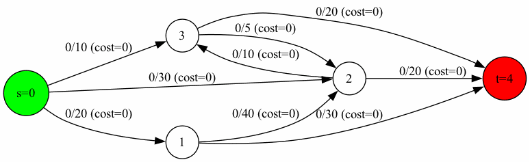

# Operations research
### Hugo Viana - 2026



Implémentation en C de plusieurs algorithmes de flot sur graphe, avec visualisation pas-à-pas via Graphviz.

## Algorithmes implémentés

| Algorithme | Flag | Description |
|---|---|---|
| Ford-Fulkerson DFS | `ff` | Recherche de chemin augmentant par DFS |
| Min Cost Flow Bellman-Ford | `mcf-bf` | Chemin de coût minimum par Bellman-Ford |
| Min Cost Flow Dijkstra | `mcf-dijkstra` | Chemin de coût minimum par Dijkstra + potentiels |
| Détection de cycle négatif | `negative-cycle` | Bellman-Ford multi-source |

## Structure du projet

```
.
├── include/
│   ├── graph.h
│   ├── ford_fulkerson.h
│   ├── min_cost.h
│   ├── negative_cycle.h
│   └── viz.h
├── src/
│   ├── main.c
│   ├── graph.c
│   ├── ford_fulkerson.c
│   ├── min_cost.c
│   ├── negative_cycle.c
│   └── viz.c
├── tests/
│   ├── test_main.c
│   ├── test_graph.c
│   ├── test_ford_fulkerson.c
│   ├── test_min_cost.c
│   └── test_negative_cycle.c
├── Makefile
├── README.md
├── Rapport.pdf
├── output.gif
└── LICENCE
```

## Compilation

```bash
make        # compile l'exécutable flowSolver
make clean  # supprime les fichiers objets
make fclean # supprime les fichiers objets et l'exécutable
make re     # recompile tout
make test   # compile et lance tous les tests unitaires
```

## Format du fichier d'entrée

Le graphe est lu depuis l'entrée standard. La première ligne contient le nombre de nœuds, le nombre d'arcs, la source et le puits. Les lignes suivantes décrivent les arcs.

```
<num_nodes> <num_arcs> <s> <t>
<from> <to> <capacity> <cost>
...
```

Exemple :

```
5 9 0 4
0 1 20 0
0 2 30 0
0 3 10 0
1 2 40 0
1 4 30 0
2 3 10 0
2 4 20 0
3 2 5  0
3 4 20 0
```

## Utilisation

```bash
# Ford-Fulkerson DFS
./flowSolver --algo ff < graphe.txt

# Min Cost Flow Bellman-Ford
./flowSolver --algo mcf-bf < graphe.txt

# Min Cost Flow Dijkstra
./flowSolver --algo mcf-dijkstra < graphe.txt

# Détection de cycle négatif
./flowSolver --algo negative-cycle < graphe.txt

# Dossier de sortie pour la visualisation
./flowSolver --algo ff --output mon_dossier < graphe.txt
```

## Visualisation

Chaque algorithme génère automatiquement des fichiers `.dot` dans le dossier spécifié avec `--output`, un par étape :

- `step_000.dot` → état initial
- `step_001.dot` → chemin augmentant trouvé (en rouge)
- `step_002.dot` → après augmentation
- ...

Pour convertir en images PNG, Graphviz doit être installé :

```bash
# Installation Graphviz
sudo apt install graphviz    # Ubuntu/Debian
brew install graphviz        # macOS

# Conversion des .dot en .png depuis le dossier de sortie spécifié
for f in step_*.dot; do
    dot -Tpng "$f" -o "${f%.dot}.png"
done
```
